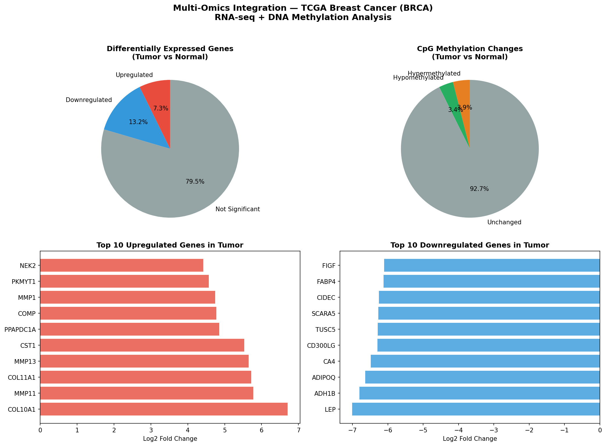
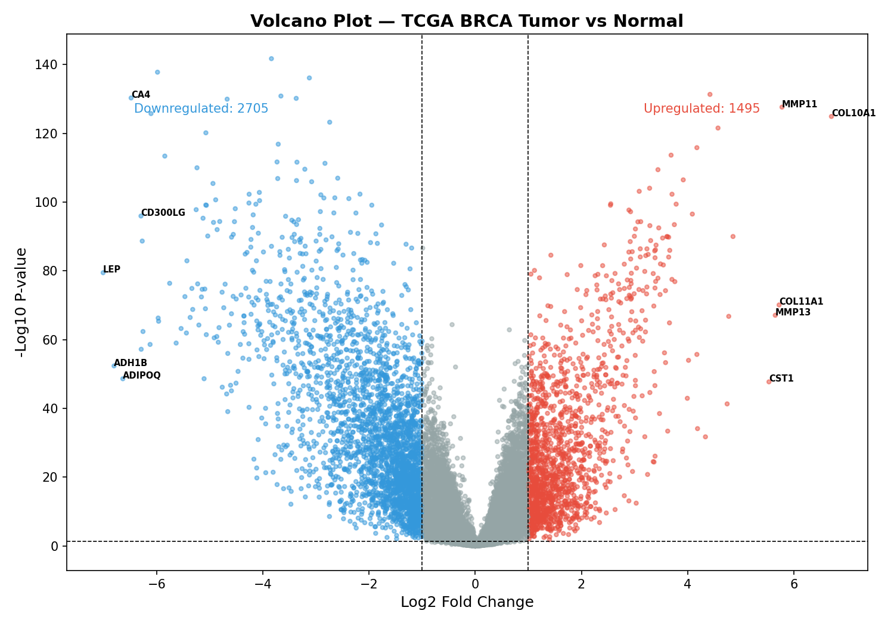
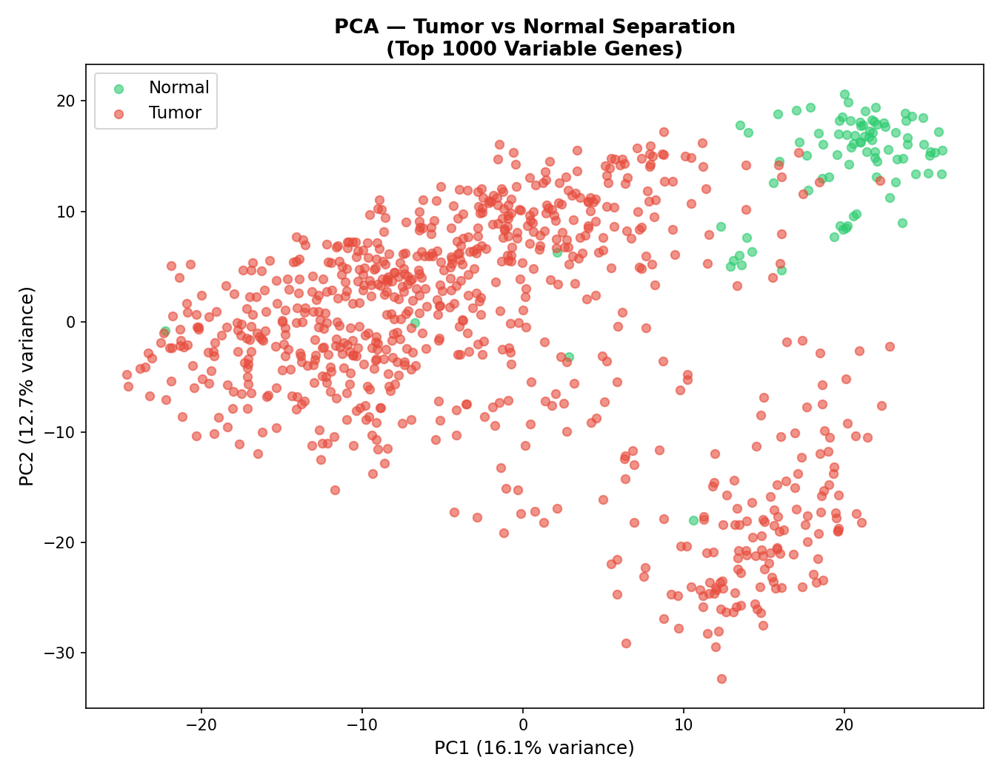
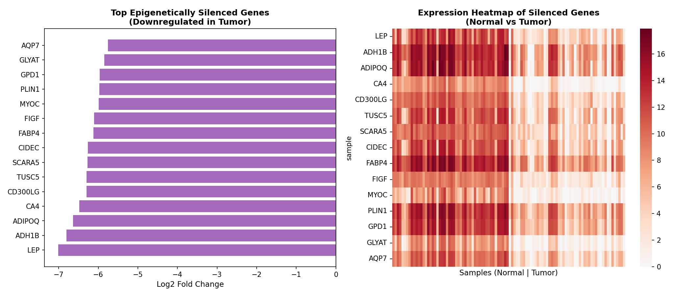
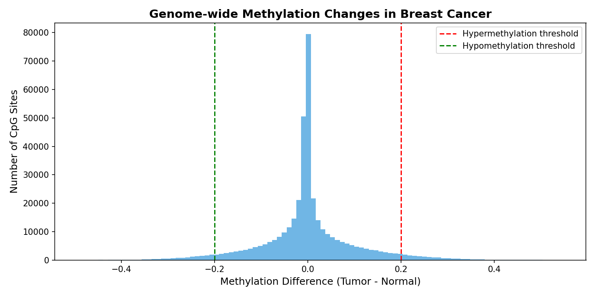

#  Multi-Omics Integration Dashboard
## TCGA Breast Cancer (BRCA) — RNA-seq + DNA Methylation Analysis

Integrated RNA-seq and DNA methylation data from 873 TCGA breast cancer patients 
to identify epigenetically silenced tumor suppressor genes.

##  Key Results
| Analysis | Result |
|----------|--------|
| Patients analyzed | 873 (multi-omics) |
| Total genes analyzed | 20,530 |
| Differentially expressed genes | 4,200 |
| Upregulated in tumor | 1,495 |
| Downregulated in tumor | 2,705 |
| Hypermethylated CpG sites | 15,642 |
| Epigenetically silenced candidates | 20 |
| Top silenced gene | LEP (Leptin) |

## Methodology

1. **Data Collection** → TCGA RNA-seq (1,218 samples) + DNA Methylation (888 samples)
2. **Integration** → Found 873 patients with BOTH data types
3. **Separation** → Split into Tumor (783) vs Normal (85) samples
4. **DEG Analysis** → t-test + Benjamini-Hochberg correction across 20,530 genes
5. **Methylation Analysis** → β-value difference between tumor and normal CpG sites
6. **Multi-Omics Integration** → Intersected downregulated genes with hypermethylated sites
7. **Result** → Identified epigenetically silenced tumor suppressor candidates

##  Visualizations

##  Tools & Libraries
- Python, Pandas, NumPy, SciPy
- Matplotlib, Seaborn, Scikit-learn
- Jupyter Notebook
- Data: UCSC Xena (TCGA-BRCA)

##  Key Biological Findings
- **COL10A1** — most upregulated gene — known cancer invasion marker
- **LEP (Leptin)** — most silenced gene — known breast cancer tumor suppressor
- **ADIPOQ** — silenced adiponectin — protective role against breast cancer
- Tumor and normal samples show clear separation in PCA (28.8% variance explained)

## 👤 Author
**Sai Tejaswi Gali** — Bioinformatics Student, VFSTR
